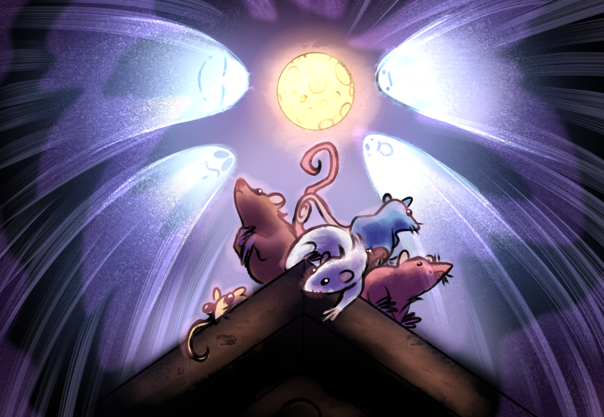
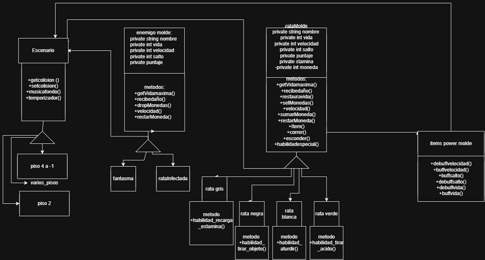

# Nombre del juego : Ghost and Ratas - The Queso CONQUEST!!!
## 1. Integrantes del Equipo 

- Santana, Lautaro Agustín
- Leal Montenegro, Ivo Ezequiel 
- Huichaquelen, Enzo Joaquín
- Escobar, Nazareno Jesus
  
## 2. Dominio y Alcance del Sistema 

### Descripción del Problema
Se busca desarrollar un video juego del genero de "plataformas" donde Eres una rata que se encuentra en el piso 4 de un edificio y tenés que llegar al piso -2 donde está la cocina, donde se encuentra el queso que queremos comer.

### Objetivo del Sistema
El sistema será un juego funcional y extensible que permitirá al jugador experimentar las mecánicas básicas del género. El diseño debe ser modular para facilitar la adición de nuevos tipos de ratas, enemigos o mapas en el futuro, aplicando rigurosamente los conceptos del paradigma orientado a objetos.

## Funcionalidades Principales (Features)
Desplazamiento: Las/las ratas se desplazan entre los pisos, esquivando las amenazas de nivel, como distintos fantasmas o baldes de agua con lavandina tirados, porque si las ratas hacen contacto con estos reciben daño.

Comida: Por los niveles hay comida tirada en buen y mal estado, que pueden darle power ups o power downs temporales a las ratitas.

Game Over: Puede ocurrir de 3 maneras posibles:Perdiste vida por un fantasma y ellos te llevaron para tenerte de mascota.

Perdiste vida por comer comida en mal estado.

Se hicieron las 6 am y llegaron los encargados de limpiar el edificio con vos incluido.

Jefe final: Hay que derrotarlo haciéndolo chocar con algunas de las amenazas del último nivel, como hornallas encendidas o cubiertos punzantes.

Fin del juego: Una vez tengamos el queso terminamos el juego y se nos muestra nuestro tiempo de juego y nuestro puntaje, que se calcula según: tiempo que se tardó en terminar el juego, puntaje por comer comida o se nos resta por comer comida en mal estado o haber recibido daño en el nivel.

#### Mecánicas de Juego
Movimiento y Controles
Movimiento básico: izquierda / derecha, salto.
Acciones especiales: agacharse, interactuar (comer, activar interruptores).
Configuración de controles (teclado, gamepad, táctil) – tabla de asignaciones.
Sistema de Daño y Vida
Puntos de vida (HP) y visualización (corazones, iconos de queso, etc.).
Fuentes de daño: fantasmas, baldes de lavandina, trampas eléctricas, pinchos, etc.
Efecto de daño: reducción de HP, posible aturdimiento o retroceso.

#### Objetos Interactables
Comida buena: otorga power‑ups temporales (velocidad, salto alto, invulnerabilidad, etc.).
Comida mala: provoca power‑downs (lentos, visión borrosa, controles invertidos, pérdida de HP).
Otros objetos: llaves, interruptores, plataformas móviles, trampas activables.

#### Enemigos y Obstáculos por Nivel
Fantasmas: patrullas estáticas o rutas predefinidas; contacto = daño.
Baldes de lavandina: áreas de peligro que infligen daño al tocar.
Trampas de piso: pinchos, láminas eléctricas, superficies resbaladizas.
Objetos del último nivel (jefe): hornallas encendidas, cubiertos punzantes que el jugador puede usar contra el jefe.
#### Sistema de Power‑Ups / Power‑Downs
Duración: temporizador visible (icono + cuenta regresiva).
Ejemplos de efectos:
Velocidad++, salto triple, invisibilidad (comida buena).
Lentos, visión borrosa, controles invertidos (comida mala).
Condiciones de Game Over

Daño por fantasma → Secuestro: la rata es capturada y se muestra una escena de “mascota”.
Comer comida en mal estado → Intoxicación: animación de enfermedad y pérdida de vida.
Llegar las 6 am: los encargados de limpieza aparecen y atrapan a la rata (incluida en la limpieza).
Pantalla de Game Over: mensaje correspondiente, opción de reiniciar o volver al menú.

### Ubicación: 
#### Jefe Final
cocina (piso -2) después de obtener el queso o como guardia del queso.
Patrón de ataque: utiliza peligros del entorno (hornallas, cubiertos) que el jugador debe hacer que el jefe golpee.
Mecánica de derrota: llevar al jefe a chocar con peligros activados por el jugador (interruptores, trampas).
Recompensa: acceso al queso y final del juego.
#### Sistema de Puntos y Tiempo
Tiempo de juego: cronómetro que comienza al iniciar y se detiene al terminar.
Puntos por comida buena: +X puntos por cada pieza consumida.
Penalización por comida mala: –Y puntos por cada pieza consumida.
Penalización por daño recibido: –Z puntos por cada punto de vida perdido (o por cada contacto con enemigo/trampa).

Puntuación final:
Score = (Puntos comida buena) – (Puntos comida mala) – (Penalizaciones daño) – (Factor tiempo opcional)
Visualización: tiempo y puntuación mostrados al final y opcionalmente durante la partida (HUD).Estructura de Niveles Pisos
Piso	Descripción	Enemigos Principales	Obstáculos	Comida Disponible

## Estructura de Niveles Pisos
| Piso | Descripción | Enemigos Principales | Obstáculos | Comida Disponible |
|------|-------------|----------------------|------------|-------------------|
| 4    | Piso de partida (apartamento) | Fantasmas de baja intensidad | Cajas, alfombras | Migas, queso rallado |
| 3    | Pasillo de servicio | Fantasmas patrullando | Tubos con fugas | Restos de pizza, fruta |
| 2    | Área de lavandería | Baldes de lavandina | Máquinas de lavar en movimiento | Detergente (mala), sobras |
| 1    | Lobby / Recepción | Fantasmas + trampas de suelo | Puertas giratorias, alfombras móviles | Golosinas, sándwiches |
| 0    | Planta baja / Garage | Fantasmas + peligros de aceite | Coches estacionados, neumáticos | Aceite (mala), hot‑dogs |
| -1   | Bodega | Fantasmas + ratas enemigas | Estanterías inestables | Conservas (buenas/malas) |
| -2   | Cocina (objetivo) | Jefe final | Hornallas, cubiertos, superficies calientes | Queso (objetivo final) |

####  Arte y Estilo Visual
Paleta de colores: tonos oscuros y sucios con acentos amarillos/verdes para power‑ups y rojos para peligros.
Sprite del protagonista: ciclo de animación (idle, walk, jump, hurt, eat, power‑up).
Entorno: tilesets para paredes, pisos, techos, objetos interactivos.
Efectos: partículas de polvo, chispas de lavandina, brillos al obtener power‑up, pantalla temblor al daño.
UI: barra de vida, contador de tiempo, íconos de activos power‑up, mini‑mapa opcional.

#### Audio y Musica
Música de fondo: tema loopable por piso (cambia ligeramente al ascender/descender).
Efectos de sonido: salto, golpe, comer (bueno/malo), daño, aparición de fantasma, activación de trampa, voz del jefe, jingle de game over, fanfara de victoria.
Voces/Opcionales: gruñidos de rata, risas fantasmas, anunciador de “¡6 am!”.
### Plan de Desarrollo
Roadmap sugerido por fases

#### Pre‑producción
Documento de diseño (este README).
Prototipo de mecánicas básicas (movimiento, salto, colisión).
Definición de arte .
#### Producción
Implementación de sistemas de vida, daño y enemigos.
Creación de niveles/pisos con sus amenazas y objetos.
Desarrollo de power‑ups/power‑downs.Programación del jefe final y su lógica.
Integración de HUD, cronómetro y puntuación.Implementación de pantalla de inicio, pausa y game over.
#### Post‑producción
Pulido de arte y animaciones.
Balanceo de dificultad (tiempo, frecuencia de enemigos, valores de poder).
Pruebas de juego y ajuste de controles.
Integración de audio y música.
Build y pruebas en plataformas objetivo.
Preparación de materiales de lanzamiento (trailer, capturas, descripción).

#### Este README es solo un punto de partida. A medida que el proyecto avance, se pueden agregar, modificar o eliminar secciones según las necesidades específicas del juego.

//Esta la portada de el juego

//Este es el Diagrama de la idea del juego (No es propiamente un DER)

//Usamos Draw.io para hacer el diagrama